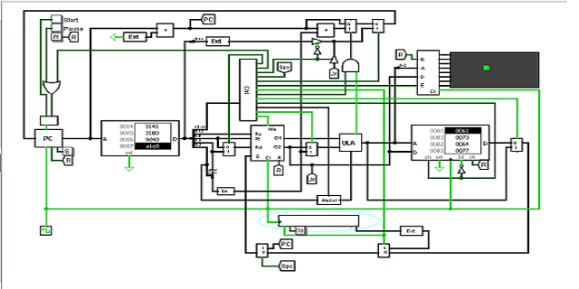

# Projeto CPU 16 bits

<blockquote>
<p><em>Projeto de caminho de dados de uma CPU 16 bits monociclo ao nível de portas lógicas, realizado utilizando o simulador de lógica digital Logisim 2.7.1</em></p>
</blockquote>  

<p align="center">
    
    
</p>

## Execução
Para a execução deste projeto utilize o programa <a href="http://www.cburch.com/logisim/">Logisim 2.7.1</a>.

## Como executar ?
Abra o arquivo .circ no Logsim e divirta-se!
O codigo assembler.py pode ser usado para converte codigos em assembly para linguagem de maquina
apropriada para esse processador, para usa-lo veja o conjunto de instruçoes abaixo.

## Conjunto de instruções:

<blockquote>
<p>Esse projeto de CPU dispõe de 8 registradores com 3 bits para endereçamento</p>
</blockquote>

```
    - RS registrador de operação
    - RT registrador de operação    
    - RD registrador de destino
```

### Tipo R:
    Formato:  Opcode RS RT RD Funct

```
     ________________________________________
    |   Instrunção  |   Opcode  |   Funct   |
    |    add        |    0000   |    000    |
    |    sub        |    0000   |    001    |
    |    and        |    0000   |    010    |
    |    or         |    0000   |    011    |
    |    not        |    0000   |    100    |
    |    slt        |    0000   |    101    |   # Set Less To            
    |    shl        |    0000   |    110    |   # Desloca a esquerda
    |    shr        |    0000   |    111    |   # Desloca a direita
    -----------------------------------------
    
```    

### Tipo I:
    Formato:  Opcode RS RT Imediato

```
     ________________________________________
    |   Instrunção  |   Opcode  |   Funct   |
    |    add        |    0000   |    000    |
    |    sub        |    0000   |    001    |
    |    and        |    0000   |    010    |
    |    or         |    0000   |    011    |
    |    not        |    0000   |    100    |
    |    slt        |    0000   |    101    |   # Set Less To            
    |    shl        |    0000   |    110    |   # Desloca a esquerda
    |    shr        |    0000   |    111    |   # Desloca a direita
    -----------------------------------------
    
```    


    
    Load Word
        return "0001"
    if(op == "sw"):     # Store Word
        return "0010"
    if(op == "addi"):   # Add immediate
        return "0011"
    if(op == "subi"):   # Subtract immediate
        return "0100"
    if(op == "beq"):    # Branch Equal
        return "0101"
    if(op == "jump"):   # Jump
        return "0110"
    if(op == "jr"):     # Jump Register
        return "0111"
    if(op == "spc"):    # Store Program Counter
        return "1000" 
    if(op == "sg"):     # Store Graphics
        return "1001" 
    if(op == "lb"):     # Load buffer Keyboad
        return "1010" 
```
        - Ajuste a resolução da imagem para a resolução do display
        - A imagem deve ser um PNG
        - Utilize o programa convert.py para converter a imagem    
        - Agora basta carreaga os dados para ROM usando o formato v3.0 hex
```
