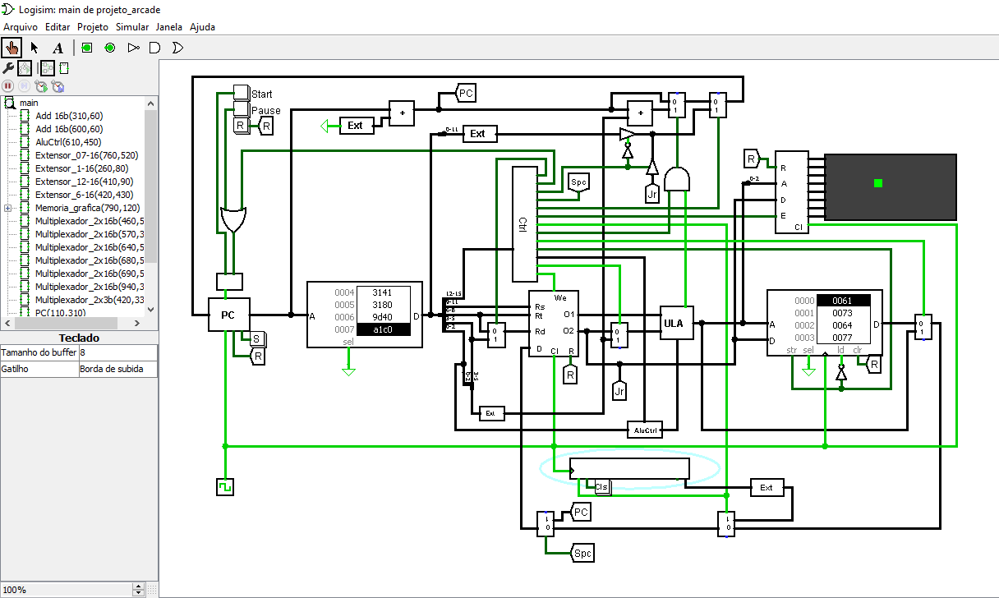

# Projeto CPU 16 bits

<blockquote>
<p><em>Projeto de caminho de dados de uma CPU 16 bits monociclo ao nível de portas lógicas, realizado utilizando o simulador de lógica digital Logisim 2.7.1</em></p>
</blockquote>  

<p>        
    
</p>

## Execução
Para a execução deste projeto utilize o programa <a href="http://www.cburch.com/logisim/">Logisim 2.7.1</a>.

## Como executar ?
Abra o arquivo .circ no Logsim e divirta-se!
<blockquote><p>
O codigo assembler.py pode ser usado para converte codigos em assembly para linguagem de maquina
apropriada para esse processador, para usa-lo veja o conjunto de instruçoes abaixo.
</p></blockquote>

## Conjunto de instruções:

<blockquote>
<p>Esse projeto de CPU dispõe de 8 registradores com 3 bits para endereçamento</p>
</blockquote>

```
    - RS registrador de operação
    - RT registrador de operação    
    - RD registrador de destino
```

### Tipo R:
```
    Formato: Opcode RS RT RD Funct
    Exemplo: 0000 001 010 011 100
    ________________________________________
    |   Instrunção  |   Opcode  |   Funct   |
    |    add        |    0000   |    000    |
    |    sub        |    0000   |    001    |
    |    and        |    0000   |    010    |
    |    or         |    0000   |    011    |
    |    not        |    0000   |    100    |
    |    slt        |    0000   |    101    |   # Set Less To            
    |    shl        |    0000   |    110    |   # Desloca a esquerda
    |    shr        |    0000   |    111    |   # Desloca a direita
    -----------------------------------------    
```    

### Tipo I:
```
    Formato: Opcode RS RT Imediato
    Exemplo: 0011 001 010 000010  
    ____________________________
    |   Instrunção  |   Opcode  |
    |    lw         |    0001   |   # Load Word    
    |    sw         |    0010   |   # Store Word
    |    addi       |    0011   |   # Add immediate
    |    subi       |    0100   |   # Subtract immediate
    |    beq        |    0101   |   # Branch Equal
    |    jr         |    0111   |   # Jump Register
    |    spc        |    1000   |   # Store Program Counter
    |    sg         |    1001   |   # Store Graphics
    |    lb         |    1010   |   # Load buffer Keyboad
    -----------------------------
```    

### Tipo J:
```
    Formato: Opcode Imediato
    Exemplo: 0110 000010000010  
    ____________________________
    |   Instrunção  |   Opcode  |
    |    jump       |    0110   |   # Jump
    -----------------------------

```    